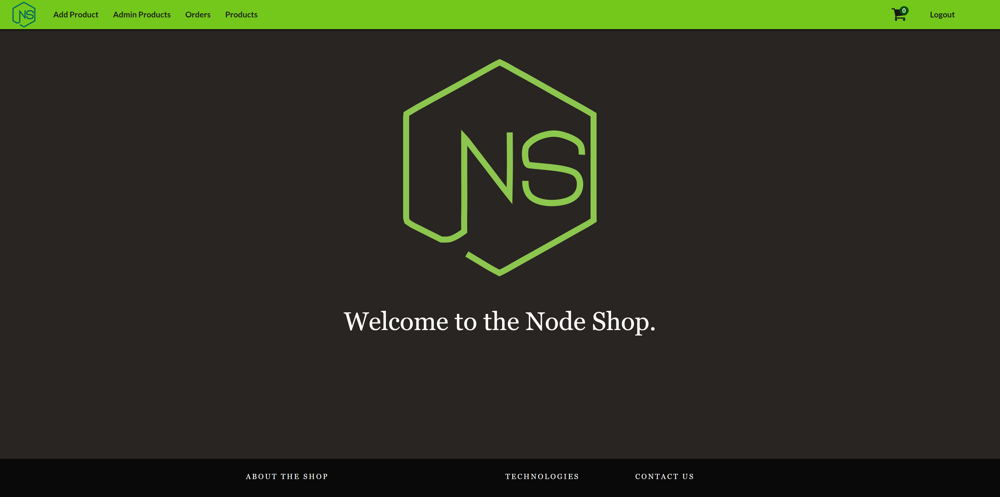
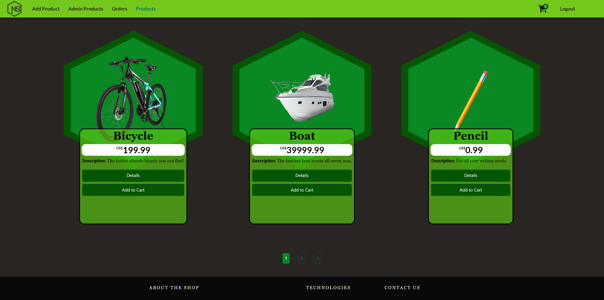

<h1 align="center">NodeShop - Multi-Page Version - A Node.js-inspired online shop, built with Node.js (Express.js).</h1>
<p align="center">
  
  <br>
  <i>This website is an example/demonstration of the sort of online shops that can be built 
    <br>with Node.js backends configured for traditional page serving (multiple html pages, templating engines such as EJS).</i>
  <br>
</p>

<p align="center">
  <a href="https://nothingnothings.github.io/NodeShopRestAPI"><strong>https://nothingnothings.github.io/NodeShopRestAPI</strong></a>
  <br>
</p>


## Introduction






Frontend Single Page Application (SPA) built with the ReactJS (create-react-app) library. The site's design, hexagon-inspired, was based on [Node.js's logo](https://nodejs.org/static/images/logos/nodejs-new-pantone-black.svg). Flexbox and media queries were used for the responsive design (attempting to cater to multiple device types, both desktop and mobile, with different resolutions). As per React's latest versions, the app was made out of functional components, moving away from the class-based ("`class App extends React.Component{}`") component approach used in the past. 

The App was bootstrapped with `create-react-app` and deployed with `gh-pages`, assisted by the GitHub Actions feature.
This app is also available as a "multi-page" app, without ReactJS. The project can be found [here](www.dummy.com).

The backend of the app, as its name suggests, utilizes Node.js (with the Express.js framework) and is hosted on the Heroku platform. The serverside code can be found [here](dummy.com).


 
## Technologies 
 
 Some of the Languages and Libraries employed:
 
 - Node Package Manager (for bootstrapping and managing the React App)
 - HTML5 
 - CSS3 (animations, Flexbox, media queries)
 - ReactJS (JavaScript Library, app built entirely of React components)
 - React Router (for the navigation between the different "pages" of the app)
 - React Redux approach for managing state (global state split between 4 reducers: `auth`, `orders`, `cart` and `shop`)
 - Bootstrap (mainly for parts of the Footer component)
 - Form validation logic using the `useState` Hook, as seen in the 'Get Started' and 'Add a Product' pages.
 - Responsive mobile design (sidebar, Flexbox, media queries)
 - Font Awesome
 - Axios (for the communication, requests and responses, between the frontend app and the Node.js/express.js backend targeted by it)
 
 
## Project Directory Structure

The development environment (with the use of the `create-react-app` tool/workflow):


```

```


The `create-react-app` workflow's production output, as shown in the `gh-pages` branch (tasked with the deployment of the app):


```

```


## Project Configuration Files (package.json)

The package.json file used in the project:

```
{
  "name": "node-shop-rest-api",
  "version": "0.2.0",
  "private": true,
  "homepage": "https://nothingnothings.github.io/NodeShopRestAPI",
  "dependencies": {
    "@fortawesome/free-regular-svg-icons": "^6.1.2",
    "@fortawesome/free-solid-svg-icons": "^6.1.2",
    "@fortawesome/react-fontawesome": "^0.2.0",
    "@reduxjs/toolkit": "^1.8.3",
    "@testing-library/jest-dom": "^5.16.4",
    "@testing-library/react": "^13.3.0",
    "@testing-library/user-event": "^13.5.0",
    "@types/react-fontawesome": "^1.6.5",
    "axios": "^0.27.2",
    "bootstrap": "^5.2.0",
    "font-awesome": "^4.7.0",
    "react": "^18.2.0",
    "react-bootstrap": "^2.4.0",
    "react-dom": "^18.2.0",
    "react-redux": "^8.0.2",
    "react-router-dom": "^6.3.0",
    "react-scripts": "5.0.1",
    "react-stripe-checkout": "^2.6.3",
    "redux": "^4.2.0",
    "redux-thunk": "^2.4.1",
    "web-vitals": "^2.1.4"
  },
  "scripts": {
    "start": "react-scripts start",
    "build": "react-scripts build",
    "test": "react-scripts test",
    "eject": "react-scripts eject"
  },
  "eslintConfig": {
    "extends": [
      "react-app",
      "react-app/jest"
    ]
  },
  "browserslist": {
    "production": [
      ">0.2%",
      "not dead",
      "not op_mini all"
    ],
    "development": [
      "last 1 chrome version",
      "last 1 firefox version",
      "last 1 safari version"
    ]
  },
  "devDependencies": {
    "@types/react": "^18.0.15",
    "gh-pages": "^4.0.0"
  }
}
```

## Setup 


To use this project, clone it using Git:

1. Run `git clone` to clone the project into your local Git repository
2. Run `npm install` to install all dependencies (`react`, `axios`, etc)
3. Run `npm run build` to create the production/deployment version of the app (outputted in `/build`)
4. Serve the production files locally or on the web, with the help of a hosting provider (although great part of the app relies/depends on the backend's data, which in the case of this demo, is served by a Node.js (Express.js) server, hosted on Heroku)
5. For the purposes of this demo, on the "Get Started" (Authentication) page, input the credentials `exemplo@exemplo.com` (email) and `exemplo` (password) to access the apps's various features


## Features 

- Single-Page Application, no page reloads, single HTML file (ReactJS)
- Application divided into many components, of which some are used more than a single time, on different pages (ReactJS design philosophy)
- Hexagon-inspired design, created with CSS
- CSS-animated SVG logo on landing page
- Responsive design (adaptive, mobile and desktop support) created with Flexbox and media queries
- Usage of GitHub Actions and GitHub Pages with the `create-react-app` utility for a seamless workflow (transition from development stage to production/deployment stage). Upon the git push command, GitHub Actions transfers the contents of the master branch into the gh-pages branch, which then deploys the app at https://nothingnothings.github.io/NodeShopRestAPI/.
- For deployment demonstration purposes, only a single user is enabled/created on the serverside, with the credentials `exemplo@exemplo.com` (email field) and `exemplo` (password field). Creation of additional users ("No account? Join NodeShop") is possible in the complete app (in this demo app, the account creation endpoints are disabled). Furthermore, the "Orders" made by the user are resetted every 60 minutes (MongoDB Time to Live Index feature), and the products added to the "Cart", every 8 hours (MongoDB "Scheduled Trigger" feature)
- Working "Shopping Cart" feature ("Add" and "Remove" products feature, with interactive "number of items" icon, synchronized with the global Redux state), implemented with `react-redux`
- Form validation logic, powered by ReactJS's state management, in the "Get Started" page
- Simple pagination logic for the list of products
- Page redirection, made possible by the usage of React Router
- Usage of Axios for communication with the Node.js (Express.js) backend, which manages the "User", "Product", "Order" and "Cart" objects, stored on a MongoDB database (MongoDB Atlas service); the Node.js server and MongoDB database also handle the authentication logic (login/signup) implemented on the app
- Dummy representation of the possible integration of shop apps with Stripe, with the `react-stripe-checkout` package and corresponding serverside logic producing effects on the frontend (page redirection and visual update of "orders" page)
- Animated custom "Loading..." Spinner
- Viewing of each order's invoices/faturas in .pdf files, produced by the backend (`pdfkit` package)


## Inspiration

This app was based on the applications seen on the "NodeJS - The Complete Guide (MVC, REST APIs, GraphQL, Deno)" and "React - The Complete Guide (incl Hooks, React Router, Redux)" courses by Maximilian Schwarzmüller.
