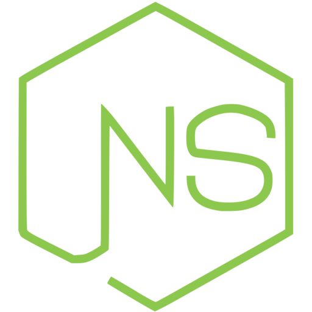
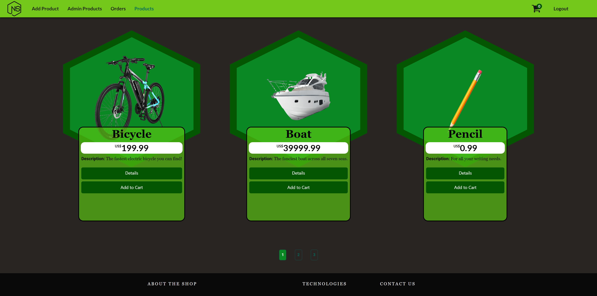

<h1 align="center">NodeShop - Versão Multi-Página - Uma loja online inspirada no Node.js, construída com Node.js (Express.js)</h1>
<p align="center">
  
  <br>
    <i>Este site é um exemplo/demonstração do tipo de lojas online que podem ser construídas 
    <br>com backends Node.js configurados para servir páginas tradicionais (várias páginas HTML, motores de template como EJS).</i>
  <br>
</p>

<p align="center">
  <a href="https://nodeshop-br-ejs.herokuapp.com"><strong>https://nodeshop-br-ejs.herokuapp.com</strong></a>
  <br>
</p>


## Introduction




Uma Aplicação Multi-Página (vários arquivos HTML, recargas de página) construída sem nenhum framework frontend JavaScript (Angular, ReactJS, Vue.js). O design do site, inspirado em hexágonos, foi baseado no [logotipo do Node.js](https://nodejs.org/static/images/logos/nodejs-new-pantone-black.svg). Flexbox e media queries foram usados para o design responsivo (tentando atender a múltiplos tipos de dispositivos, tanto desktop quanto mobile, com diferentes resoluções). O aplicativo também foi "traduzido" para uma versão de Página Única, ReactJS, que pode ser encontrada [aqui](https://github.com/nothingnothings/NodeShopRestAPI).


Para o deployment, a plataforma escolhida foi o Heroku, com suas capacidades dinâmicas de hospedagem de backend (Node.js, Python, PHP, Go).

O backend do aplicativo, como seu nome sugere, utiliza Node.js (com o framework Express.js). O código serverside pode ser encontrado na branch `master`.


[](https://github.com/nothingnothings/NodeShopMultiPageApp)
[](https://github.com/nothingnothings/NodeShopMultiPageApp/blob/master/README.pt-br.md)

 
## Tecnologias 
 
Algumas das linguagens e bibliotecas empregadas:

- Node Package Manager (para inicializar e gerenciar a aplicação serverside Node.js/Express.js)
 - Node.js
 - Express.js
- EJS (templating engine, utilizada para realizar o serve dinâmico dos arquivos HTML/.ejs/view ao usuário)
 - Abordagem MVC (Model-View-Controller)
 - HTML5 
 - CSS3 (animações, Flexbox, media queries)
 - Vanilla JavaScript
 - Bootstrap (principalmente para partes do componente Footer)
 - Heroku (solução de hospedagem de backend dinâmico)
 - MongoDB (solução de armazenamento de banco de dados noSQL; armazenamento de objetos de usuário, produto e pedido em coleções em um banco de dados remoto MongoDB Atlas)
 - Utilização da biblioteca Font Awesome
 
 
## Estrutura do Diretório do Projeto

A estrutura de diretórios do backend, seguindo o padrão MVC (Model-View-Controller):


```
.\
│
├── config\
│   ├── keys.js
│   └── prod.js
│
├── controllers\
│   ├── admin.js
│   ├── auth.js
│   ├── error.js
│   └── shop.js
│
├── faturas\
│   ├── fatura-62e04d5c7ae0d991d83b1323.pdf
│   ├── fatura-62e18ad75511c94e87929855.pdf
│   ├── fatura-62e1a06e5511c94e87929fa4.pdf
│   ├── fatura-62e1a1e05511c94e8792a071.pdf
│   ├── fatura-62eb1fa9e4c7306961ced46b.pdf
│   ├── fatura-62fd18d0d5b3ded6079d3e0d.pdf
│   └── fatura-62fd9b7a3ff693a3cac15ac0.pdf
│
├── images\
│   ├── 1658431838529-Bike.png
│   ├── 1658432590831-Boat.png
│   ├── 1658433107407-Pencil.png
│   ├── 1658433305838-Skateboard.png
│   ├── 1658433495040-keyboard.png
│   ├── 1658434189280-A set of tires.png
│   ├── 1658434649972-Boomerang.png
│   ├── 1658435067043-Drums.png
│   ├── 1658435608982-Violin.png
│   ├── NodeShopBlack.png
│   ├── android-chrome-192x192.png
│   ├── android-chrome-512x512.png
│   ├── apple-touch-icon.png
│   ├── browserconfig.xml
│   ├── favicon-16x16.png
│   ├── favicon-32x32.png
│   ├── favicon.ico
│   ├── mstile-150x150.png
│   └── site.webmanifest
│
├── middleware\
│   └── isAuth.js
│
├── models\
│   ├── order.js
│   ├── product.js
│   └── user.js
│
├── public\
│   │
│   ├── css\
│   │   ├── auth.css
│   │   ├── cart.css
│   │   ├── edit-product.css
│   │   ├── footer.css
│   │   ├── index.css
│   │   ├── main.css
│   │   ├── orders.css
│   │   └── product.css
│   │
│   └── js\
│       ├── admin.js
│       ├── forms.js
│       └── main.js
│
│
├── routes\
│   ├── admin.js
│   ├── auth.js
│   └── shop.js
│
├── snapshot\
│   ├── NodeShop1.png
│   └── NodeShop2.png
│
├── util\
│   └── path.js
│
├── views\
│   │
│   ├── admin\
│   │   ├── edit-product.ejs
│   │   └── product-list-admin.ejs
│   │
│   ├── auth\
│   │   ├── login.ejs
│   │   └── signup.ejs
│   │
│   ├── includes\
│   │   ├── end.ejs
│   │   ├── footer.ejs
│   │   ├── head.ejs
│   │   ├── navigation.ejs
│   │   └── pagination.ejs
│   │
│   ├── shop\
│   │   ├── cart.ejs
│   │   ├── checkout.ejs
│   │   ├── index.ejs
│   │   ├── orders.ejs
│   │   ├── product-detail.ejs
│   │   └── product-list.ejs
│   │
│   ├── 404.ejs
│   └── 500.ejs
│
├── .gitignore
├── Procfile
├── README.md
├── app.js
├── package-lock.json
└── package.json

```


## Arquivos de Configuração do Projeto (package.json)

O arquivo package.json usado no projeto:

```
{
  "name": "nodeshop-ejs",
  "version": "1.0.0",
  "description": "",
  "main": "index.js",
  "scripts": {
    "test": "echo \"Error: no test specified\" && exit 1",
    "start": "node app.js"
  },
  "author": "",
  "license": "ISC",
  "devDependencies": {
    "font-awesome": "^4.7.0"
  },
  "dependencies": {
    "bcryptjs": "^2.4.3",
    "body-parser": "^1.19.0",
    "connect-flash": "^0.1.1",
    "connect-mongodb-session": "^3.1.1",
    "csurf": "^1.11.0",
    "ejs": "^3.1.6",
    "express": "^4.17.1",
    "express-session": "^1.17.2",
    "express-validator": "^6.13.0",
    "mongodb": "^4.1.3",
    "mongoose": "^6.0.12",
    "multer": "^1.4.3",
    "pdfkit": "^0.13.0",
    "stripe": "^8.191.0"
  }
}
```

## Configuração


Para usar este projeto, clone-o usando o Git:

1. Execute `git clone` para clonar o projeto em seu repositório Git local.
2. Execute `npm install` para instalar todas as dependências (`express`, `express-session`, `express-validator`, `bcryptjs`, `body-parser`, `mongodb`).
3. Execute `npm start` para iniciar o aplicativo Node.
4. Sirva os arquivos de produção localmente (com pacotes como `nodemon`) ou na web, com a ajuda de um provedor de hospedagem.
5. Para fins desta demonstração, na página "Get Started" (Autenticação), insira as credenciais `exemplo@exemplo.com` (email) e `exemplo` (senha) para acessar os diversos recursos do aplicativo.

## Features 

- Aplicação Multi-Página, com recargas de página, múltiplas visualizações geridas pelo motor de template EJS.
- Design inspirado em hexágonos, criado com CSS.
- Logotipo SVG animado em CSS na página inicial.
- Design responsivo (adaptável, suporte a dispositivos móveis e desktop) criado com Flexbox e media queries.
- Uso do GitHub com Heroku. Ao executar o comando git push, o GitHub transfere o conteúdo da branch master para o projeto Heroku, que então implanta o aplicativo em https://nodeshop-br-ejs.herokuapp.com.
- Para fins de demonstração de deploy, apenas um único usuário é habilitado/criado no lado do servidor, com as credenciais exemplo@exemplo.com (campo de email) e exemplo (campo de senha). A criação de usuários adicionais ("Sem conta? Junte-se ao NodeShop") é possível no aplicativo completo (neste aplicativo de demonstração, os endpoints de criação de conta estão desativados). Além disso, as "Orders" feitas pelo usuário são redefinidas a cada 60 minutos (recurso Time to Live Index, do MongoDB), e os produtos adicionados ao "Cart", a cada 8 horas (recurso de "Scheduled Trigger" do MongoDB)
- Comunicação das páginas HTML servidas com o backend Node.js (Express.js), que gerencia os objetos "Usuário", "Produto", "Pedido" e "Carrinho", armazenados em um banco de dados MongoDB (serviço MongoDB Atlas); o servidor Node.js e o banco de dados MongoDB também gerenciam a lógica de autenticação (login/cadastro) implementada no aplicativo.
- Funcionalidade de "Carrinho de Compras" ("Adicionar" e "Remover" produtos, com ícone interativo de "número de itens", implementada pela integração do backend com o frontend, chamadas `res.render()`), criada como um subdocumento dos objetos `user` armazenados no banco de dados MongoDB.
- Lógica simples de paginação para a lista de produtos.
- Lógica de autenticação simples, implementada com "express-session" (autenticação baseada em sessão), "bcryptjs" e "connect-mongodb-session" (armazenamento de sessões em banco de dados noSQL).
- Representação fictícia da possível integração de aplicativos de loja com Stripe.
- Visualização das faturas de cada pedido em arquivos .pdf, produzidos pelo backend (pacote `pdfkit`).
- Uso de variáveis de ambiente com Heroku para ocultar informações sensíveis (API_KEYS, segredos de Json Web Token, nomes de usuário e senhas de banco de dados, etc.).
- Lógica de validação de formulários no frontend, com JavaScript vanilla.
- Abordagem tradicional de envio de formulários (elemento "button" dentro de um "form"; dados de login enviados como requisição "POST" para o endpoint `/login` no backend) e validação de campos "email" e "senha" no lado do servidor (pacote `express-validator`, métodos como "isEmail()" e "isAlphanumeric()").
- Uso de Font Awesome e Bootstrap (no rodapé da página).
- Favicon personalizado, compatível com múltiplos dispositivos.


## Inspiração

Este aplicativo foi baseado nas aplicações vistas no curso "NodeJS - The Complete Guide (MVC, REST APIs, GraphQL, Deno)" de Maximilian Schwarzmüller.


